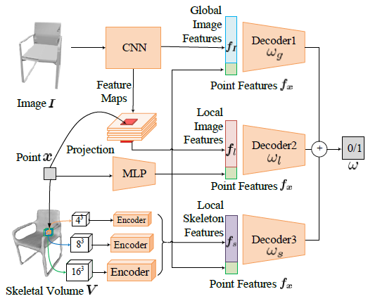

# Skeleton-Regularized Deep Implicit Surface Network (SkeDISN)
<p align="center">

</p>

## System Requirements
  * ### GPU: 1080Ti (Other models can consider decrease the batch size if overflow)
  * ### system: Ubuntu 16.04 (if your linux version can support tensorflow 1.10, it's going to be ok)
  * ### tensorflow 1.10(should be able to run with 1.11, 1.12,1.13)
```
  pip install trimesh==2.37.20
```

## Installation
  ```
    cd {SkeDISN}
    mkdir checkpoint
    cd checkpoint
    wget https://www.dropbox.com/s/2ts7qc9w4opl4w4/SDF_DISN.tar 
    ### or google drive: https://drive.google.com/file/d/1PEXVxXflVqWNqinSMC-hFmFdlMyoMZ7i/view?usp=sharing
    ### or baidu yunpan: https://pan.baidu.com/s/1Zujo84JoTcTW5dUl0AvS_w   extraction code: esy9
    tar -xvzf SkeDISN.tar
    rm -rf SkeDISN.tar
    cd ..
    mkdir cam_est/checkpoint
    cd cam_est/checkpoint
    wget https://www.dropbox.com/s/hyv4lcvpfu0au9e/cam_DISN.tar
    ### or google drive https://drive.google.com/file/d/1S5Gh_u1C9vDvksqXDn3CP6IqsnU0hKkj/view?usp=sharing
    ### or baidu yunpan: https://pan.baidu.com/s/1lEHmSHA1o5lrswp0TM50qA   extraction code: gbb3
    tar -xvzf cam_DISN.tar
    rm -rf cam_DISN.tar
    cd ../../
    Install whatever libary(e.g. mkl) you don't have and change corresponding libary path in your system in isosurface/LIB_PATH
  ```
## Demo:
 * You can download [the pre-trained model of SkeDISN](https://drive.google.com/file/d/1qMebY8qdbwCFRSTzJZoQ8T7sd9o4Mbu6/view?usp=sharing) and unzip it to the ```./checkpoint/skedisn_occ``` folder.
 * --sdf_res control the resolution of the sampled sdf, default is 64, the larger, the more fine-grained, but slower.
  ```
    cd {SkeDISN}
    source isosurface/LIB_PATH
    python test/create_sdf_add_skevox.py --ske_local_patch_share --binary  --img_feat_twostream --sdf_res 256 --log_dir checkpoint/skedisn_occ --use_predvox --predvox_dir  {specify your predicted skeleton volume directory} --img_path 03001627_1e304b967d5253d5dd079f8cece51712_00
  ```
  or run this script:
  ```
    bash scripts/demo.sh
  ```
  if you have dependency problems such as your mkl lib, etc. Please install the corresponding dependencies and change the path in LIB_PATH. Everyone has his/her/their own environment setting so it's impossible to instruct this step without sitting besides you and your server.
 
## Data Preparation

* ### file location setup:
  * under preprocessing/info.json, you can change the locations of your data: the neccessary dir for the main model are : 
   ```  
        "raw_dirs_v1": {
          "mesh_dir": "/ssd1/datasets/ShapeNet/ShapeNetCore.v1/",
          "norm_mesh_dir": "/ssd1/datasets/ShapeNet/march_cube_objs_v1/",
          "rendered_dir": "/ssd1/datasets/ShapeNet/ShapeNetRendering/",
          "renderedh5_dir": "/ssd1/datasets/ShapeNet/ShapeNetRenderingh5_v1/",
          "sdf_dir": "/ssd1/datasets/ShapeNet/SDF_v1/",
          "ske_vox_dir": "your own path to /ShapeNetV1_skeleal_volume/",
        }
   ```
  
* ### Download ShapeNetCore.v1 
  download the dataset following the instruction of https://www.shapenet.org/account/  (about 30GB)
  
  ```
  cd {your download dir}
  wget http://shapenet.cs.stanford.edu/shapenet/obj-zip/ShapeNetCore.v1.zip 
  unzip ShapeNetCore.v1.zip -d {your mesh_dir}
  ```
  
* ### Prepare the SDF ground truth and the marching cube reconstructed ground truth models 

  Download our generated sdf tar.gz from [here](https://drive.google.com/file/d/1cHDickPLKLz3smQNpOGXD2W5mkXcy1nq/view?usp=sharing) then place it at your "sdf_dir" in json; and the marching cube reconstructed ground truth models from the sdf file from [here](https://drive.google.com/drive/folders/1QGhDW335L7ra31uw5U-0V7hB-viA0JXr?usp=sharing) then place it at your "norm_mesh_dir" in your json.

  If you want to generate sdf files and the reconstructed models by yourself, please follow the command lines below (Please expect the script to run for several hours). This step used this paper [Vega: non-linear fem deformable object simulator](http://run.usc.edu/vega/SinSchroederBarbic2012.pdf). Please also cite it if you use our code to generate sdf files
  ```
  mkdir log
  cd {SkeDISN}
  source isosurface/LIB_PATH
  nohup python -u preprocessing/create_point_sdf_grid.py --thread_num {recommend 9} --category {default 'all', but can be single category like 'chair'} &> log/create_sdf.log &
  
  ## SDF folder takes about 9.0G, marching cube obj folder takes about 245G
  
  ```
* ### Download and generate 2d image h5 files:
  * #### download 2d image following 3DR2N2[https://github.com/chrischoy/3D-R2N2], please cite their paper if you use this image tar file:
  
  ```
  wget http://cvgl.stanford.edu/data2/ShapeNetRendering.tgz
  untar it to {your rendered_dir}
  ```
  * #### run h5 file generation (about 26 GB) :
  
  ```
  cd {SkeDISN}
  nohup python -u preprocessing/create_img_h5.py &> log/create_imgh5.log &
  ```

* ### To accelerate the dataloader during training, we use compressed skeleltal volumes.
  ```
  python preprossing/compress_skeletalvolume.py {specify your input and output directories}
  ```

## Training:

* ### train the SkeDISN with provided camera parameters:

  if train from scratch, you can load official pretrained vgg_16 by setting --restore_modelcnn; or you can  --restore_model to your checkpoint to continue the training):

  * support flip the background color from black to white since most online images have white background(by using --backcolorwhite)
  * if use flag --cam_est, the img_h5 is loaded from {renderedh5_dir_est} instead of {renderedh5_dir}, so that we can train the generation on the estimated camera parameters

  * #### we firstly train the DISN to predict occupancy fields.
  ```
  nohup python -u train/train_sdf.py --gpu 0 --binary --img_feat_twostream --restore_modelcnn ./models/CNN/pretrained_model/vgg_16.ckpt --log_dir checkpoint/disn_occ --category all --num_sample_points 2048 --batch_size 20 --learning_rate 0.0001 --cat_limit 36000 &> log/DISN_train_all.log &
  ```
  or run this script:
  ```
  bash scripts/DISNOcc.sh
  ```

  * #### Then we freeze the pretrained network of DISN and only train the skeleton-branch.
  ```
  python train/train_sdf_add_skevox.py --free_onlylocal --ske_local_patch_share --gpu 0 --binary --img_feat_twostream --restore_modeldisn checkpoint/disn_occ/model.ckpt  --log_dir skedisn_freeskeleton_occ --category all --num_sample_points 2048 --max_epoch 20 --batch_size 10 --learning_rate 0.00003 --decay_step 80000 --cat_limit 36037 --use_predvox --predvox_dir {specify your predicted skeleton volume directory} &> log/SkeDISN_train_all.log &
  ```
  or run this script:
  ```
  bash scripts/SkeDISNOcc_freeskeleton.sh
  ```

  * #### Finally, we free all network parameters of SkeDISN.
  ```
  python train/train_sdf_add_skevox.py --ske_local_patch_share --gpu 0 --binary --img_feat_twostream --restore_model skedisn_freeskeleton_occ--restore_modeldisn checkpoint/disn_occ/model.ckpt  --log_dir skedisn_occ --category all --num_sample_points 2048 --max_epoch 10 --batch_size 10 --learning_rate 0.000003 --decay_step 80000 --cat_limit 36037 --use_predvox --predvox_dir {specify your predicted skeleton volume directory} &> log/SkeDISN_train_all.log &
  ```
  or run this script:
  ```
  bash scripts/SkeDISNOcc.sh
  ```


* ### inference occupancy fields and create mesh objects from a single-view image:

  * will save objs in {your training checkpoint dir}/test_objs/{sdf_res+1}_{iso}
  * will save objs in {your training checkpoint dir}/test_objs/{sdf_res+1}_{iso}
  * if use estimated camera post, --cam_est, will save objs in {your training checkpoint dir}/test_objs/camest_{sdf_res+1}_{iso}
  * if only create chair or a single category, --category {chair or a single category}
  * --sdf_res control the resolution of the sampled sdf, default is 64, the larger, the more fine-grained, but slower.
  ```
  source isosurface/LIB_PATH
  ```
  #### use ground truth camera pose
  ```
  source isosurface/LIB_PATH
  nohup python -u test/create_sdf_add_skevox.py --ske_local_patch_share --binary --img_feat_twostream --sdf_res 64 --gpu 0 --log_dir checkpoint/skedisn_occ --category all --use_predvox --predvox_dir {specify your predicted skeleton volume directory} --test_allset &> log/SkeDISN_create_all.log &
  ```
  or
  ```
  bash scripts/create_SkeDISNOcc.sh
  ```
  
* ### clean small objects:
  * #### if the model doens't converge well, you can clean flying parts that generated by mistakes
  Concretely, we choose to clean flying parts for the categories of rifle and watercraft.
  ```
  nohup python -u clean_smallparts.py --src_dir checkpoint/{your training checkpoint dir}/test_objs/65_0.0 --tar_dir checkpoint/{your training checkpoint dir}/test_objs/65_0.0 --thread_n 10 &> log/SkeDISN_clean.log &
  ```

* ### Although trained for single-view reconstruction, our proposed SkeDISN can be directly extended for mesh reconstruction from multi-view images:
  ```
  nohup python -u test/create_sdf_add_skevox.py --ske_local_patch_share --binary --img_feat_twostream --sdf_res 64 --gpu 0 --log_dir checkpoint/skedisn_occ --category all --use_predvox --predvox_dir {specify your predicted skeleton volume directory} --view_num 3 {specify the number of input views} --test_allset &> log/mutiview_SkeDISN_create_all.log &
  ```
  or
  ```
  bash scripts/create_multiview_SkeDISNOcc.sh
  ```

## Evaluation:
### please compile models/tf_ops/ approxmatch and nn_distance
  * ### Chamfer Distance:
    * #### We use ground-truth surfaces from [ShapeNetV1-Surface-Skeleton](https://drive.google.com/file/d/1FlXiWFuBbryyNvyH07kGGl9WlmuYPVAP/view?usp=sharing) to calculate the chamfer distance. 
    * #### For comparative methods (e.g. SkeGCNN) whose outputs are aligned with ShapeNet V1, we use test_cd_only.py. For comparative methods (e.g. SkeDISN) whose outputs are normalized to unit sphere, we use test_cd_alignv1.py
    * --cal_dir specify which obj folder to be tested, e.g. if only test watercraft, --category watercraft
    * --mesh_sample whether calcuate CD between sampled point sets.
    * --num_points_gt number of sampled points for each ground-truth mesh 
    * --num_points_pred number of sampled points for each predicted mesh 
  ```
    nohup python -u test/test_cd_only.py --name SkeGCNN --explicit --mesh_sample --num_points_gt 10000 --num_points_pred 10000 --gpu 0 --batch_size 1 --log_dir {your save directory of evaluation results} --cal_dir {your generation directory of SkeGCNN} --category all &> log/SkeGCNN_cd_all.log & 
  ```
  ```
    nohup python -u test/test_cd_alignv1.py --name SkeDISN --mesh_sample --num_points_gt 10000 --num_points_pred 10000 --gpu 0 --batch_size 1 --log_dir {your save directory of evaluation results} --cal_dir checkpoint/{your SkeDISN training checkpoint dir}/test_objs/65_0.0 --category all &> log/SkeDISN_cd_all.log & 
  ```

 * ### IOU caluculation:
    * #### We use ground-truth surfaces from [marching cubes meshes of DISN](https://drive.google.com/drive/folders/1QGhDW335L7ra31uw5U-0V7hB-viA0JXr?usp=sharing) to calculate the IoU. For comparative methods (e.g. SkeGCNN) whose outputs are aligned with ShapeNet V1, we use test_iou_aligndisn.py. For comparative methods (e.g. SkeDISN) whose outputs are normalized to unit sphere, we use test_iou_disndata.py
    * cal_dir specify which obj folder to be tested, e.g. if only test watercraft, --category watercraft
    * --res specify the number of voxels along each 3D dimension.
    ```
      nohup python -u test/test_iou_aligndisn.py --name SkeGCNN --explicit --res 64 --log_dir {your save directory of evaluation results} --cal_dir {your generation directory of SkeGCNN} --category all &> log/SkeGCNN_iou_all.log & 
    ```
    ```
      nohup python -u test/test_iou_disndata.py  --name SkeDISN --res 64 --log_dir {your save directory of evaluation results} --cal_dir checkpoint/{your SkeDISN training checkpoint dir}/test_objs/65_0.0 --category all &> SkeDISN_iou_all.log &
    ```
