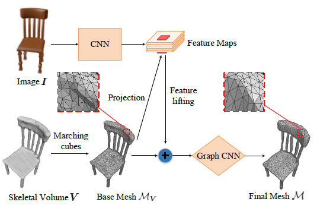

# Skeleton-Based Graph CNN (SkeGCNN)

<p align="center">
  
</p>

## Data

The ground truth point clouds (with normals) for learning explicit mesh recoveries are from [ShapeNetV1-Surface-Skeleton](https://drive.google.com/file/d/1FlXiWFuBbryyNvyH07kGGl9WlmuYPVAP/view?usp=sharing).

The base mesh information is obtained by converting ```*.obj``` to  ```.pkl``` to read the vertices, edges, and faces of base meshes.
Before running the script, you need to specify your own datapaths.
```shell
basemesh_dir=your own basemesh folder
info_dir=the ouput directory
python ./data/dump_basemesh_info.py --basemesh_dir $bamesh_dir --info_dir info_dir
```

## Installation

We provide the extension modules for the computation of CD and EMD. You can compile them via
```shell
cd external
Modify the nvcc, cudalib and tensorflow librarries to your own paths.
make 
cd ..
```

## Demo
You can download [the pre-trained model of SkeGCNN](https://drive.google.com/file/d/1F7tTIMFyw-Yz6dTGRy3s1Aw_XfaRGUUa/view?usp=sharing) and unzip it to the ```./checkpoint/skegcnn``` folder.
```shell
basemesh_root='your base mesh folder'
checkpoint='./checkpoint/skegcnn'
bash scripts/demo.sh
```

## Training

You can train the SkeGCNN by run the script: 
```shell
bash scripts/train.sh
```

## Generation
* You can generation mesh results of testset: 
```shell
bash scripts/gen.sh
```

## Evaluation

* You evalute the quantative results like CD, EMD, F-score, and IoU: 
```shell
bash scripts/eval.sh
```