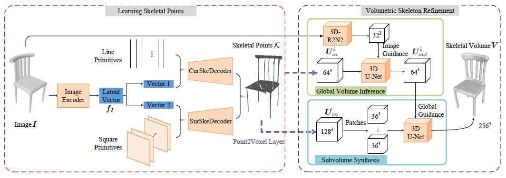

# SkeletoneNet

<p align="center">
  
</p>

## Compile Chamfer Distance
You need to compile chamfer distance used for both training and evalution.
```shell
cd extention
python setup.py install
cd ..
```

## Compile other external function
* You also need to compile other functions (marching cubes and mesh simplification). These useful codes are from [Occupancy Network](https://github.com/autonomousvision/occupancy_networks). Thanks for their contributions.
* To do so, just run the below script.
```shell
python setup.py build_ext --inplace
```

## Demo
* We provide a demo for skeletal volume generation from RGB images via learning immediate skeletal points.
You can download the pretrained model from [here](https://drive.google.com/file/d/1WH0Nf30AWFOkBo0oWL9bzlNIWPvnwDiR/view?usp=sharing), and put it under the ```checkpoints/all``` folder.
* Run the demo by the below script:
```shell 
python demo/demo.py --model checkpoints/all/SkeletonNet.pth --num_points_line 4000 --num_points_square 20000 --samples_line 0 --samples_triangle 0 --save_vox_h5 --save_mesh --save_ske --inpimg ../demo_images/03001627_1e304b967d5253d5dd079f8cece51712_00.png --outdir ../demo_results
```
or run this script:
```shell 
bash scripts/all/demo.sh
```

## Training
1. SkeAE: Skeletal points auto encoder
```shell 
bash scripts/all/ae_cursur.sh
```

2. SkeSVR: Skeletal points generation from single RGB images
```shell 
bash scripts/all/svr_cursur.sh
```

3. SkeVolume: Skeletal volume refinement from initial skeletal points
```shell 
bash scripts/all/global.sh
bash scripts/all/local.sh
```

4. End-to-End: End-to-end training of Skeletal points generation and volume refinement'
```shell 
bash scripts/all/end2end.sh
```

## Skeletal Point Sets Generation & Evaluation
1. Generating from skeletal points regression module or end-to-end SkeletonNet module:
```shell 
python skeleton_gen/SVR_CurSur.py --category chair --model $model_ske
python volume_eval/eval_local.py  --category chair --model $model_ske --outdir $output_dir --save_ske 
python volume_eval/eval_end2end.py  --category chair --model $model_end2end --outdir $output_dir --save_ske
``` 
   
2. Evaluating skeletal point sets by Chamfer distance
```shell 
python skeletal_eval/eval_cd.py --category all --log_dir ./skeleton_eval --cal_dir $your skeleton output_dir
```

## Skeletal Volume Generation & Evaluation
1. Generating from skeletal volume refinement module and end-to-end SkeletonNet module:
```shell
python volume_eval/eval_local.py --category all --model_ske $model_ske --model $model_volume --th $threshold
python volume_eval/eval_end2end.py --category all --model $model_end2end --th $threshold
```

2. Evaluation results by IoU are acquired after you run above generation scripts.

3. Saving SkeletonNet outputs for both trainset and testset.
```shell
python volume_gen/gen_local.py --category all --model_ske $model_ske --model $model_volume --th $threshold
python volume_gen/gen_end2end.py --category all --model $model_end2end --th $threshold
```
* When extracting coarse meshes to bridge explicit mesh generation, you need to add ```--save_mesh --outdir_mesh $your basemesh output_dir```.
* When generating refined volumes to regularize implicit mesh generation, you need to add ```--save_vox_h5 --outdir_vox $your volume output dir```.